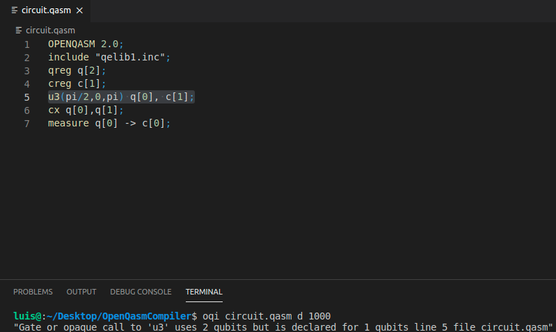
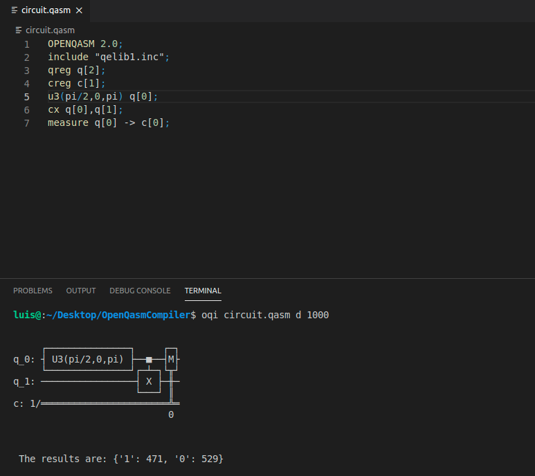

# OpenQasmInterpreter (oqi)

This package interprets a .qasm file and then outputs the results to the console. All of the executions are made using the qasm simulator. Moreover you can specify different options to run your circuit. 

To just run your .qasm file you'll have to run:

```{r test-python, engine='bash'}
oqi filename
```

Additionally if you want to see and run your circuit you can execute:
```{r test-python, engine='bash'}
oqi filename d
```

Finally if you want to run your circuit **n** number of times you can specify the repetitions:
```{r test-python, engine='bash'}
oqi filename d n
```
or
```{r test-python, engine='bash'}
oqi filename n
```

In any case the output will include something of the form:
```{r test-python, engine='bash'}
The results are: {'bits': numberOfMeasurements, ...}
```

## Instalation
Install it with the pip package manager:
```{r test-python, engine='bash'}
pip install oqi
```

## Features

Custom errors:



Draw and run your circuits:



## Acknowledgements

The token analyser as well as many other things needed in order to run the interpreter came from the [qiskit repo](https://github.com/Qiskit). My apportation was to create the pip package and some wrapping in order to run the interpreter.